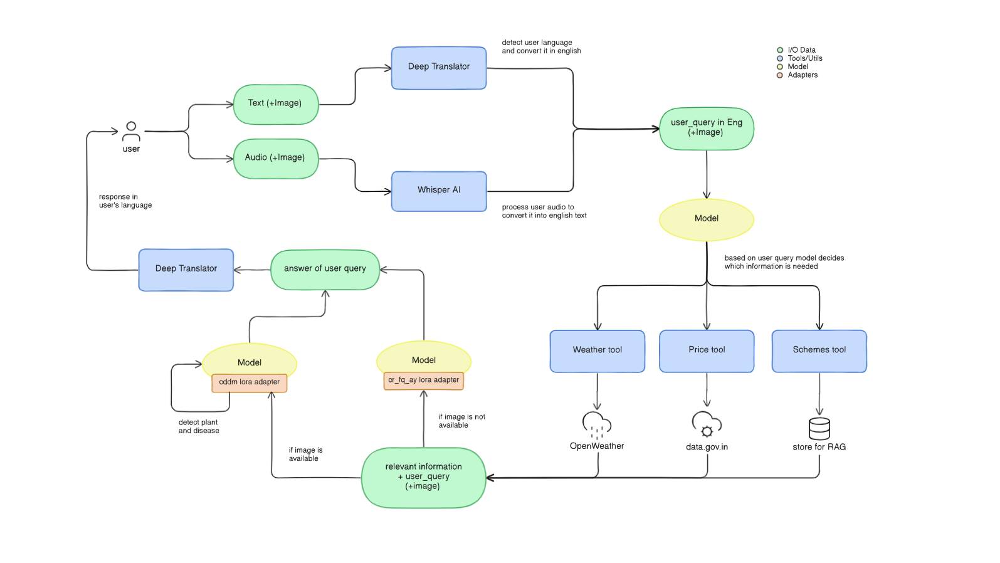
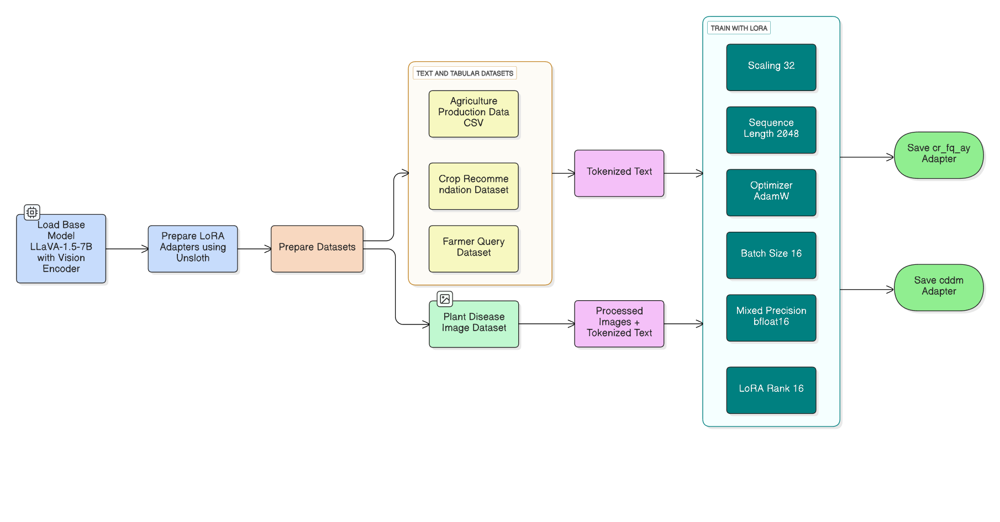
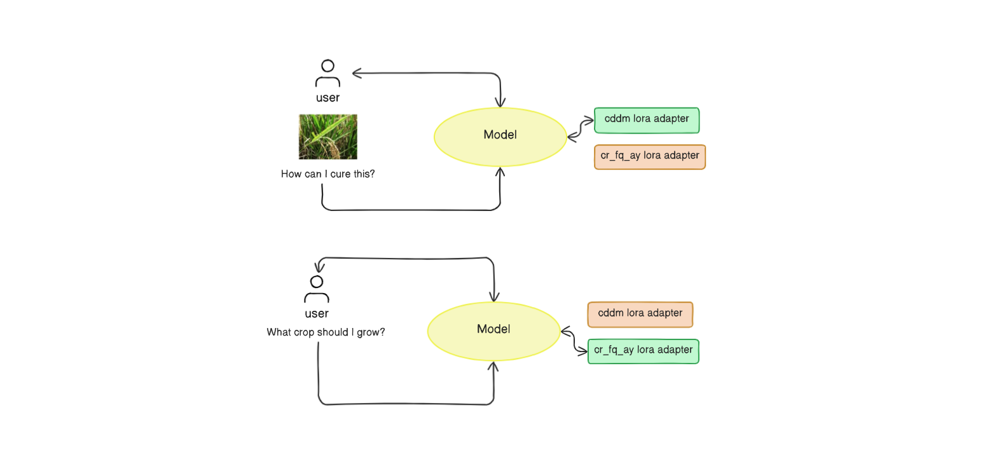
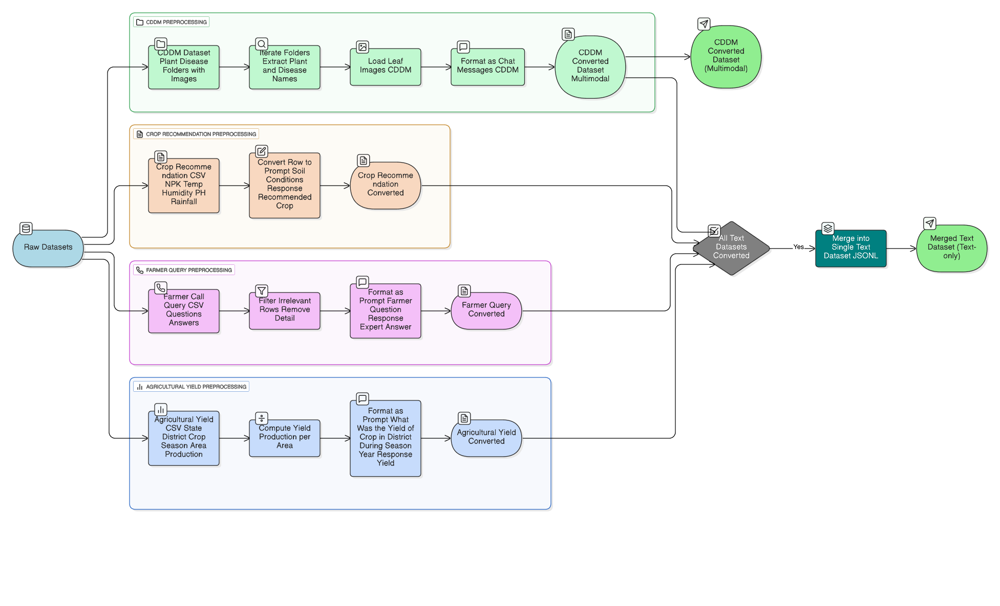
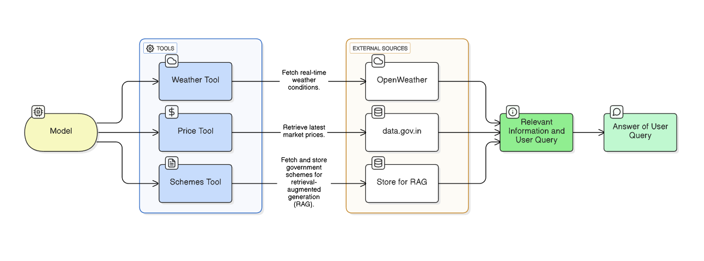
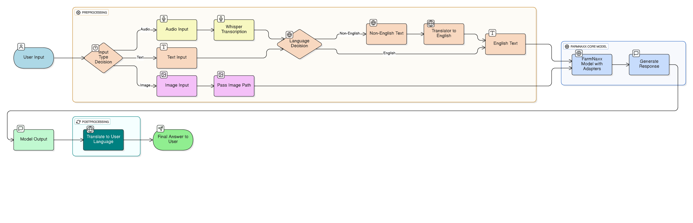
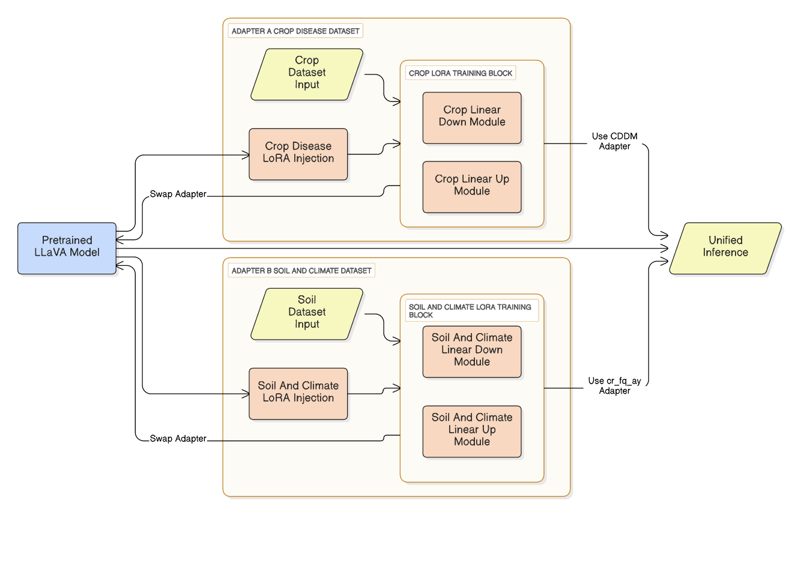

# Farmnaxx-Codebase

Notebook 1: [Fine-Tuning Llava 1.5 7B on Agricultural Datasets](https://www.kaggle.com/code/sachidanandnavik/fine-tuning-llava-1-5-7b-on-agricultural-datasets/notebook)   
Notebook 2: [Farmnaxx- Model Inference](https://www.kaggle.com/code/krisgg/farmnaxx-finall)  

Farmnaxx is a human-aligned agentic AI system for agriculture that leverages multimodal LLMs (text, image, audio) to support farmers with actionable insights.  
It combines fine-tuned LLaVA models, LoRA adapters, and external tools (Weather, Price, Schemes) to deliver context-aware, human-aligned responses.  

*   **User Interaction Layer:** This layer, equipped with Deep Translator and Whisper AI, processes multilingual text and audio inputs, converting them into a standardized format for the core reasoning layer.
*   **Agentic Tooling Layer:** This intelligent layer classifies incoming queries and dynamically routes them to the most relevant tool, such as the OpenWeather API for weather forecasts or internal databases for market prices and government schemes.
*   **Core Reasoning Layer:** At the heart of the system is a fine-tuned LLaVA-1.5-7B model enhanced with specialized LoRA adapters for agricultural tasks. These adapters are dynamically swapped based on the input modality (text or image) to ensure efficient and accurate processing.
*   **External Knowledge Integration:** The system leverages Retrieval-Augmented Generation (RAG) to pull in real-time information from external sources like government public datasets and weather APIs, ensuring the advice provided is both current and reliable.
*   **Response Generation Layer:** The final output is synthesized from the AI model and external data, translated back into the user's native language, and delivered in a clear and natural format.

## Repository Structure

- **adapters/** → Fine-tuned LoRA adapters  
  - llava-1.5-7b-finetuned-for-cddm → Plant disease detection (image + text)  
  - llava-1.5-7b-finetuned-for-cr_fq_ay → Crop recommendation, farmer queries, yield prediction  
  - llava-next-7b-qlora-sft-plant-disease → Experimental  
  - qwen2_5vl-7b-qlora-sft-plant-disease → Experimental  

- **datasets/** → Agricultural datasets  
  - AgrcultureDataset.csv → Yield dataset  
  - Crop_recommendation.csv → Soil & climate crop recommendation  
  - Farmer_call_query_dataset.csv → Farmer queries + expert responses  
  - CDDM Dataset (not in repo due to size) → Plant disease image dataset  

- **figures/** → Diagrams & architecture  
  - agentic_tooling.png  
  - data_preprocessing.png  
  - farmnaxx_io_diagram.png  
  - low_level_model_diagram.png  
  - model_fine_tune.png  

- **notebooks/**  
  - fine-tuning-llava-1-5-7b-on-agricultural-datasets.ipynb → End-to-end fine-tuning notebook  

- **farmnaxx-Doc.pdf** → Full technical documentation  

---

## Key Components

### LoRA Adapters
  
- CDDM Adapter → Trained for plant disease classification from leaf images.  
- CR_FQ_AY Adapter → Trained for crop recommendation, farmer queries, yield estimation.  

- Support for hot-swapping adapters at inference.  

### Datasets
  
- CDDM Dataset → Multimodal (text + image) leaf disease dataset.  
- Crop Recommendation Dataset → Soil nutrient & weather → crop mapping.  
- Farmer Call Query Dataset → Question-answer format from real farmer queries.  
- Agriculture Yield Dataset → Crop yield estimation per district/state.  

### Tooling Layer
  
- Weather Tool → Real-time weather (OpenWeather API).  
- Price Tool → Market prices (data.gov.in).  
- Schemes Tool → Govt. schemes stored & retrieved via RAG.  

### I/O Flow
  
- Handles text, audio, and images.  
- Whisper → Preprocesses audio.  
- Deep Translator → Converts to/from English.  
- Unified query passed to Farmnaxx Model.  
- Output translated back to user’s language.  

---

## Tech Stack

- LLMs & VLMs: LLaVA-1.5, Qwen2.5-VL  
- Fine-tuning: LoRA (via Unsloth, QLoRA)  
- Frameworks: PyTorch, Hugging Face, Transformers  
- Datasets: Multimodal + structured agricultural data  
- Tooling APIs: OpenWeather, data.gov.in  
- Multilingual Support: Whisper AI + Deep Translator  
- RAG (Retrieval-Augmented Generation): Govt. schemes & knowledge storage  

---

## Features

- Multimodal Input (Text + Image + Audio)  
- Plant Disease Detection (leaf image → diagnosis)  
- Crop Recommendation (soil + weather → best crop)  
- Farmer Query Resolution (real call query dataset)  
- Agricultural Yield Prediction (tons/hectare)  
- Tool Integration (weather, price, schemes)  
- Multilingual (auto-detection & translation)  

---

## System Architecture

  

1. User input (text/audio/image) → Preprocessing (Whisper + Translator)  
2. Farmnaxx model + LoRA adapter selected (based on query type)  
3. Model reasoning + external tools if needed  
4. Unified response → Back-translated to user’s language  

---

## Documentation

Full technical writeup in:  
[farmnaxx-Doc.pdf](./farmnaxx-Doc.pdf)

---

## Future Work

- Extend multilingual support to more Indian languages  
- Hybrid Knowledge Graph + RAG for agriculture  
- On-device deployment for low-resource settings  

---

Farmnaxx: Empowering Farmers with AI-driven Insights.
