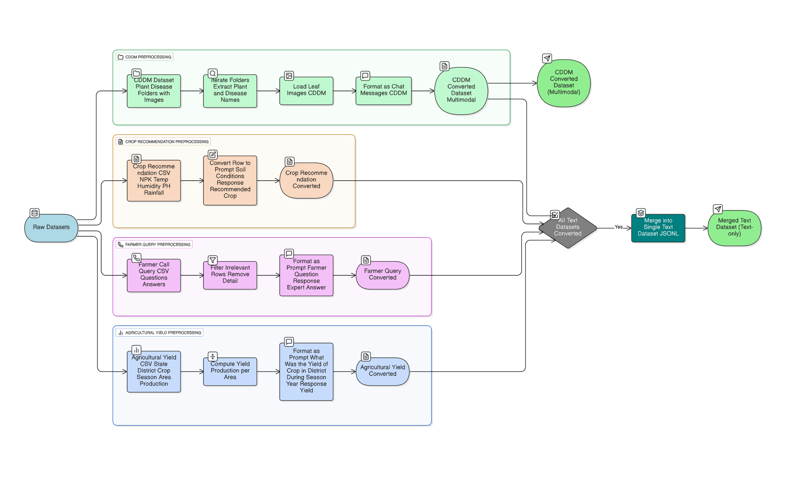
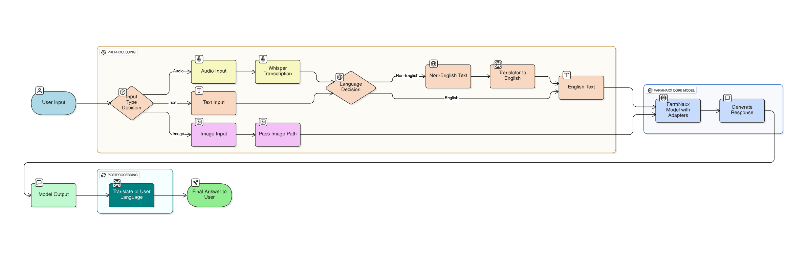
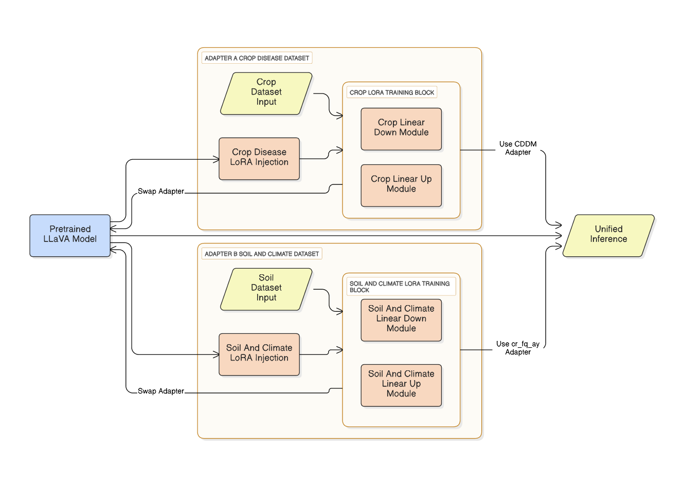

<<<<<<< HEAD
# Farmnaxx-Codebase

[Model Inference](https://www.kaggle.com/code/krisgg/farmnaxx-finall)
[Fine-Tuning Llava 1.5 7B on Agricultural Datasets](https://www.kaggle.com/code/sachidanandnavik/fine-tuning-llava-1-5-7b-on-agricultural-datasets/notebook)

Farmnaxx is a human-aligned agentic AI system for agriculture that leverages multimodal LLMs (text, image, audio) to support farmers with actionable insights.  
It combines fine-tuned LLaVA models, LoRA adapters, and external tools (Weather, Price, Schemes) to deliver context-aware, human-aligned responses.  
=======
# Farmnaxx: A Human-Aligned Agentic AI System for Agricultural Decision Making

## Overview

Farmnaxx is an advanced, multimodal AI-powered advisory system designed to empower farmers in India. By integrating text, voice, and image inputs, Farmnaxx provides crucial, real-time information and recommendations on crop management, disease detection, market prices, and government schemes. This system is engineered to overcome challenges such as weather variability, market fluctuations, and information gaps, which are prevalent in Indian agriculture. It is a direct result of the Capital One Launchpad 2025 Hackathon.

Farmnaxx utilizes a sophisticated agentic AI framework that combines fine-tuned Large Language and Vision Models (LLaVA) with Retrieval-Augmented Generation (RAG). This allows the system to deliver precise, context-aware, and actionable advice in a cost-effective and easily deployable manner, even in low-connectivity environments. The platform is designed with a focus on accessibility, supporting multiple Indian languages and dialects through voice and text, making it a vital tool for farmers regardless of their literacy level.

## Key Features

*   **Multimodal Input:** Farmers can interact with the system using text, voice, and images of their crops.
*   **Multilingual Support:** The system recognizes and processes queries in various Indian languages and dialects, making it accessible to a diverse agricultural community.
*   **Agentic AI Framework:** Farmnaxx employs an agentic AI that intelligently routes farmer queries to the appropriate tool, whether it's a weather API, a government subsidy database, or an image-based crop disease classifier.
*   **Crop Disease Detection:** By analyzing images of leaves, the system can accurately diagnose plant diseases and suggest actionable remedies.
*   **Personalized Recommendations:** Farmnaxx provides tailored advice on crop selection based on soil composition, weather patterns, and local conditions.
*   **Real-time Information:** The system offers up-to-date information on market prices, weather forecasts, and government subsidy schemes.
*   **Decision Support:** By integrating structured agronomic data with visual cues, Farmnaxx offers comprehensive support for critical farming decisions.

## System Architecture

The Farmnaxx system is built on a robust and scalable architecture that seamlessly integrates multilingual and multimodal inputs with fine-tuned AI models and external data sources.

The core components of the system include:
>>>>>>> 84ff8dc5ecd67a56cd88850a72713afc7f533258

*   **User Interaction Layer:** This layer, equipped with Deep Translator and Whisper AI, processes multilingual text and audio inputs, converting them into a standardized format for the core reasoning layer.
*   **Agentic Tooling Layer:** This intelligent layer classifies incoming queries and dynamically routes them to the most relevant tool, such as the OpenWeather API for weather forecasts or internal databases for market prices and government schemes.
*   **Core Reasoning Layer:** At the heart of the system is a fine-tuned LLaVA-1.5-7B model enhanced with specialized LoRA adapters for agricultural tasks. These adapters are dynamically swapped based on the input modality (text or image) to ensure efficient and accurate processing.
*   **External Knowledge Integration:** The system leverages Retrieval-Augmented Generation (RAG) to pull in real-time information from external sources like government public datasets and weather APIs, ensuring the advice provided is both current and reliable.
*   **Response Generation Layer:** The final output is synthesized from the AI model and external data, translated back into the user's native language, and delivered in a clear and natural format.

<<<<<<< HEAD
## Repository Structure

- **adapters/** → Fine-tuned LoRA adapters  
  - llava-1.5-7b-finetuned-for-cddm → Plant disease detection (image + text)  
  - llava-1.5-7b-finetuned-for-cr_fq_ay → Crop recommendation, farmer queries, yield prediction  
  - llava-next-7b-qlora-sft-plant-disease → Experimental  
  - qwen2_5vl-7b-qlora-sft-plant-disease → Experimental  

- **datasets/** → Agricultural datasets  
  - AgrcultureDataset.csv → Yield dataset  
  - Crop_recommendation.csv → Soil & climate crop recommendation  
  - Farmer_call_query_dataset.csv → Farmer queries + expert responses  
  - CDDM Dataset (not in repo due to size) → Plant disease image dataset  

- **figures/** → Diagrams & architecture  
  - agentic_tooling.png  
  - data_preprocessing.png  
  - farmnaxx_io_diagram.png  
  - low_level_model_diagram.png  
  - model_fine_tune.png  

- **notebooks/**  
  - fine-tuning-llava-1-5-7b-on-agricultural-datasets.ipynb → End-to-end fine-tuning notebook  

- **farmnaxx-Doc.pdf** → Full technical documentation  

---

## Key Components

### LoRA Adapters
  
- CDDM Adapter → Trained for plant disease classification from leaf images.  
- CR_FQ_AY Adapter → Trained for crop recommendation, farmer queries, yield estimation.  
- Support for hot-swapping adapters at inference.  

### Datasets
  
- CDDM Dataset → Multimodal (text + image) leaf disease dataset.  
- Crop Recommendation Dataset → Soil nutrient & weather → crop mapping.  
- Farmer Call Query Dataset → Question-answer format from real farmer queries.  
- Agriculture Yield Dataset → Crop yield estimation per district/state.  

### Tooling Layer
  
- Weather Tool → Real-time weather (OpenWeather API).  
- Price Tool → Market prices (data.gov.in).  
- Schemes Tool → Govt. schemes stored & retrieved via RAG.  

### I/O Flow
  
- Handles text, audio, and images.  
- Whisper → Preprocesses audio.  
- Deep Translator → Converts to/from English.  
- Unified query passed to Farmnaxx Model.  
- Output translated back to user’s language.  

---

## Tech Stack

- LLMs & VLMs: LLaVA-1.5, Qwen2.5-VL  
- Fine-tuning: LoRA (via Unsloth, QLoRA)  
- Frameworks: PyTorch, Hugging Face, Transformers  
- Datasets: Multimodal + structured agricultural data  
- Tooling APIs: OpenWeather, data.gov.in  
- Multilingual Support: Whisper AI + Deep Translator  
- RAG (Retrieval-Augmented Generation): Govt. schemes & knowledge storage  

---

## Features

- Multimodal Input (Text + Image + Audio)  
- Plant Disease Detection (leaf image → diagnosis)  
- Crop Recommendation (soil + weather → best crop)  
- Farmer Query Resolution (real call query dataset)  
- Agricultural Yield Prediction (tons/hectare)  
- Tool Integration (weather, price, schemes)  
- Multilingual (auto-detection & translation)  

---

## System Architecture

  

1. User input (text/audio/image) → Preprocessing (Whisper + Translator)  
2. Farmnaxx model + LoRA adapter selected (based on query type)  
3. Model reasoning + external tools if needed  
4. Unified response → Back-translated to user’s language  

---

## Documentation

Full technical writeup in:  
[farmnaxx-Doc.pdf](./farmnaxx-Doc.pdf)

---

## Future Work

- Extend multilingual support to more Indian languages  
- Hybrid Knowledge Graph + RAG for agriculture  
- On-device deployment for low-resource settings  

---

Farmnaxx: Empowering Farmers with AI-driven Insights.
=======
## Technology Stack

Farmnaxx is developed using a combination of open-source tools and frameworks that support multimodal data processing and large-scale model training and deployment.

*   **Programming Language:** Python 3.11
*   **Deep Learning Frameworks:** PyTorch, HuggingFace Transformers
*   **AI Models:** LLaVA 1.5 (7B), Whisper (OpenAI)
*   **Speech and Translation:** Whisper AI, Deep Translator
*   **Data Preprocessing and Storage:** Pandas, NumPy, JSON/JSONL
*   **Model Training and Experimentation:** Kaggle Notebooks, Google Colab, HuggingFace Hub

## Datasets

The effectiveness of Farmnaxx is rooted in the diverse and comprehensive datasets used for its training and fine-tuning. These datasets encompass a wide range of agricultural information, from crop production statistics to farmer queries.

The primary datasets include:

*   **CDDM Plant Disease Dataset:** A paired image-text dataset containing 13,7000 plant and leaf images with corresponding disease and health information.
*   **Agriculture Production Dataset:** A structured dataset with crop production data from various Indian states and districts, including details on crop type, season, and yield.
*   **Crop Recommendation Dataset:** This dataset contains soil and climate parameters, providing a basis for recommending optimal crops for different environmental conditions.
*   **Farmer Query-Response Dataset:** A conversational dataset of farmer queries and expert responses, used to fine-tune the model for advisory dialogues.

## Overcoming Challenges

The development of Farmnaxx addressed several significant challenges common to large-scale vision-language systems:

*   **Handling Hallucinations:** To ensure the factual accuracy of the generated advice, a robust Retrieval-Augmented Generation (RAG) pipeline was implemented. This grounds the model's responses in verified external data from government documents and agricultural extension guidelines.
*   **Multilingual and Code-Switched Queries:** A specialized translation and normalization pipeline was created to handle the linguistic diversity of Indian farmers, including the common practice of code-switching.
*   **Noisy and Incomplete Data:** Advanced data processing and error correction techniques, including a vector-based semantic search, were employed to manage inconsistencies in the source data.
*   **Scalability and Extensibility:** The use of modular LoRA adapters allows for the easy addition of new crops, regions, or languages without the need to retrain the entire model.
*   **Sustainability and Accessibility:** The system is designed to be computationally efficient, utilizing 4-bit quantization and other techniques to ensure it can be deployed on affordable hardware and accessed in areas with limited internet connectivity.

## Future Work

The Farmnaxx team is committed to the continuous improvement and expansion of the platform. Future development will focus on:

*   **Integration of Additional Domain-Specific Adapters:** Expanding the system's capabilities to include pest outbreak prediction, fertilizer optimization, and climate-resilient crop planning.
*   **Continuous Learning with Community Feedback:** Implementing a feedback loop to incorporate user interactions and corrections, continually improving the model's accuracy and relevance.
*   **Enhanced Offline Capabilities:** Developing more robust on-device inferencing for core functionalities to better serve users in low-bandwidth environments.
*   **Cross-Sector Expansion:** Extending the platform to support related agricultural sectors such as crop insurance, credit scoring, and supply chain management.
*   **Responsible AI and Fairness:** Further enhancing the transparency and fairness of the AI models to ensure unbiased and ethically sound advice for all smallholder farmers.

## Contributing

Contributions are what make the open-source community such an amazing place to learn, inspire, and create. Any contributions you make are **greatly appreciated**.

If you have a suggestion that would make this better, please fork the repo and create a pull request. You can also simply open an issue with the tag "enhancement".

1.  Fork the Project
2.  Create your Feature Branch (`git checkout -b feature/AmazingFeature`)
3.  Commit your Changes (`git commit -m 'Add some AmazingFeature'`)
4.  Push to the Branch (`git push origin feature/AmazingFeature`)
5.  Open a Pull Request

## License

Distributed under the MIT License. See `LICENSE` for more information.

## Acknowledgments

*   [A Multimodal Benchmark Dataset and Model for Crop Disease Diagnosis](https://github.com/UnicomAI/UnicomBenchmark/tree/main/CDDMBench)
*   [Crop recommendatation Dataset](https://www.kaggle.com/datasets/atharvaingle/crop-recommendation-dataset)
*   [Farmer Call Query (Kisan Call Centre)](https://www.kaggle.com/datasets/daskoushik/farmers-call-query-data-qa)
*   [Fine-Tuning Llava 1.5 7B on Agricultural Datasets](https://www.kaggle.com/code/sachidanandnavik/fine-tuning-llava-1-5-7b-on-agricultural-datasets)
*   [Indian Agriculture Yeild Dataset](https://www.kaggle.com/code/prasadkevin/crops-prediction-indian-dataset/data)
>>>>>>> 84ff8dc5ecd67a56cd88850a72713afc7f533258
